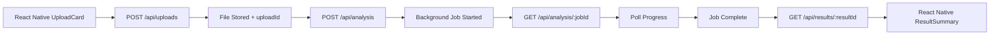

# 🩸 Bloodwork Analysis API

A complete NestJS backend for AI-powered bloodwork analysis with background job processing, file uploads, and intelligent health recommendations.

## 🚀 Features

- **📤 File Upload**: Secure PDF bloodwork file handling with validation
- **🔬 AI Analysis**: Background job processing with progress tracking
- **📊 Smart Insights**: AI-powered health recommendations and risk assessment
- **🔄 Real-time Polling**: Job status updates with progress indicators
- **🗄️ SQLite Database**: Zero-config development database
- **⚡ Redis Queues**: Reliable background job processing
- **🌐 React Native Ready**: CORS-enabled API designed for mobile integration

## 📱 MVP Flow



## 🛠️ Setup & Installation

### Prerequisites

- **Node.js** (v18 or higher)
- **Redis** (for background jobs)
- **npm** or **yarn**

### 1. Install Dependencies

```bash
npm install
```

### 2. Start Redis (Required for Background Jobs)

**macOS (Homebrew):**
```bash
brew install redis
brew services start redis
```

**Linux (Ubuntu/Debian):**
```bash
sudo apt-get install redis-server
sudo systemctl start redis-server
```

**Windows:**
Download and install Redis from the official website or use Docker:
```bash
docker run -d -p 6379:6379 redis:latest
```

### 3. Environment Configuration

The app uses sensible defaults, but you can customize via `.env`:

```bash
# Server Configuration
PORT=3000
NODE_ENV=development

# Database (SQLite - zero config)
DATABASE_PATH=./bloodwork.db

# Redis Configuration
REDIS_URL=redis://localhost:6379

# File Upload Settings
UPLOAD_PATH=./uploads
MAX_FILE_SIZE=10485760  # 10MB

# API Configuration
API_PREFIX=api
```

### 4. Create Upload Directory

```bash
mkdir -p uploads
```

### 5. Start the Server

**Development Mode:**
```bash
npm run start:dev
```

**Production Mode:**
```bash
npm run build
npm run start:prod
```

## 📡 API Endpoints

### 🏥 Health & Info
- `GET /api/` - API information and status
- `GET /api/health` - Detailed health check
- `GET /api/info` - Complete API documentation

### 📤 File Upload
- `POST /api/uploads` - Upload PDF bloodwork files
  - **Body**: `multipart/form-data` with `file` field
  - **Response**: `{ uploadId, fileUrl }`
  - **Validation**: PDF only, max 10MB

### 🔬 Analysis
- `POST /api/analysis` - Start AI analysis
  - **Body**: `{ uploadId: string }`
  - **Response**: `{ jobId, status }`
- `GET /api/analysis/:jobId` - Poll job status
  - **Response**: `{ jobId, status, progress, resultId?, errorMessage? }`

### 📊 Results
- `GET /api/results/:resultId` - Get complete analysis
  - **Response**: Enhanced bloodwork results with AI recommendations

## 🧪 Testing the API

### 1. Check API Health
```bash
curl http://localhost:3000/api/health
```

### 2. Upload a PDF
```bash
curl -X POST http://localhost:3000/api/uploads \
  -F "file=@/path/to/bloodwork.pdf"
```

### 3. Start Analysis
```bash
curl -X POST http://localhost:3000/api/analysis \
  -H "Content-Type: application/json" \
  -d '{"uploadId":"your-upload-id"}'
```

### 4. Poll Job Status
```bash
curl http://localhost:3000/api/analysis/your-job-id
```

### 5. Get Results
```bash
curl http://localhost:3000/api/results/your-result-id
```

## 🏗️ Architecture

### 📁 Project Structure
```
src/
├── 📂 config/          # Environment configuration
├── 📂 common/          # Shared entities and DTOs
│   ├── entities/       # Database models
│   └── dto/           # Data transfer objects
├── 📂 uploads/         # File upload module
├── 📂 analysis/        # Background job processing
├── 📂 results/         # AI results and recommendations
├── 📂 app.module.ts    # Main application module
└── 📂 main.ts         # Application bootstrap
```

### 🗄️ Database Schema
- **Upload**: File metadata and storage paths
- **AnalysisJob**: Background job status and progress
- **BloodworkResult**: AI analysis results and insights

### 🔄 Background Processing
1. **File Upload** → Immediate response with `uploadId`
2. **Analysis Request** → Job queued in Redis
3. **Background Processor** → AI simulation with progress updates
4. **Result Storage** → Enhanced results with AI recommendations
5. **Client Polling** → Real-time status updates

## 🤖 AI Integration

### Current Implementation
The system includes a sophisticated AI simulation that provides:
- **Medical Context Analysis**: Understands bloodwork patterns
- **Personalized Recommendations**: Contextual health advice  
- **Risk Assessment**: Severity scoring and follow-up timing
- **Safety Features**: Medical disclaimers and professional guidance

### Real AI Integration
To integrate with real AI services (OpenAI, medical AI APIs):

1. **Update `AiRecommendationsService`**:
   ```typescript
   // src/results/ai-recommendations.service.ts
   // Replace generateMockAiRecommendations() with real AI calls
   ```

2. **Add API Keys to Environment**:
   ```bash
   OPENAI_API_KEY=your-key-here
   MEDICAL_AI_ENDPOINT=https://your-ai-service.com
   ```

3. **The Rest Stays the Same**: Your React Native app will continue working without any changes!

## 🔌 React Native Integration

### Update Your Frontend API Base URL
```typescript
// bloodwork_app/src/shared/api/base.ts
const BASE_URL = 'http://localhost:3000/api'; // Your backend URL
```

### Ready-to-Use Components
Your React Native app's existing components work immediately:
- **UploadCard** → `POST /api/uploads`
- **AnalysisProgress** → `GET /api/analysis/:jobId` (polling)
- **ResultSummary** → `GET /api/results/:resultId`

## 🔧 Development

### Available Scripts
- `npm run start:dev` - Start in development mode with hot reload
- `npm run build` - Build for production
- `npm run start:prod` - Start production server
- `npm run test` - Run unit tests
- `npm run test:e2e` - Run end-to-end tests

### Database Management
The SQLite database is automatically created. For advanced operations:
```bash
# View database schema
sqlite3 bloodwork.db ".schema"

# Query data
sqlite3 bloodwork.db "SELECT * FROM upload;"
```

### Redis Management
```bash
# Connect to Redis CLI
redis-cli

# View all keys
redis-cli KEYS "*"

# Monitor job activity
redis-cli MONITOR
```

## 🚀 Production Deployment

### Environment Variables
```bash
NODE_ENV=production
PORT=3000
DATABASE_PATH=/app/data/bloodwork.db
REDIS_URL=redis://your-redis-host:6379
UPLOAD_PATH=/app/uploads
```

### Security Considerations
- Configure CORS for specific domains
- Add authentication middleware
- Use PostgreSQL for production database
- Implement file virus scanning
- Add rate limiting
- Set up proper logging

### Docker Deployment
```dockerfile
FROM node:18-alpine
WORKDIR /app
COPY package*.json ./
RUN npm ci --only=production
COPY dist ./dist
CMD ["npm", "run", "start:prod"]
```

## 🩺 Monitoring & Health Checks

### Health Endpoints
- `/api/health` - Application and service status
- `/api/uploads/health` - File upload service health
- Redis connection status included in health checks

### Logging
- Structured logging for all operations
- Job progress tracking
- Error tracking and reporting
- Performance metrics

## 🎯 Next Steps

1. **Connect React Native**: Update your app's API base URL
2. **Test MVP Flow**: Upload → Analyze → Poll → Results
3. **Add Real AI**: Integrate with medical AI services
4. **Enhance Features**: Add user authentication, history, etc.
5. **Deploy**: Move to production with PostgreSQL and Redis

## 🤝 Contributing

This backend is designed for easy extension:
- Add new analysis types
- Integrate additional AI services
- Enhance recommendation algorithms
- Add new file format support

---

**🎉 Your complete bloodwork analysis backend is ready!**

Start the server and connect your React Native app for a fully functional AI-powered health analysis platform.